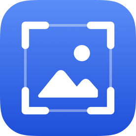
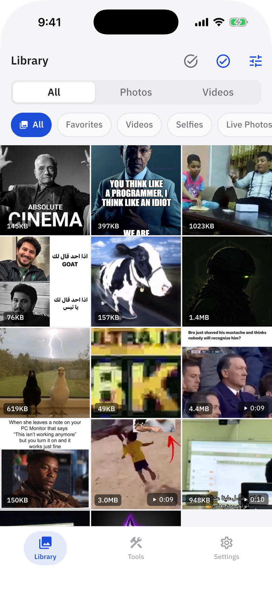
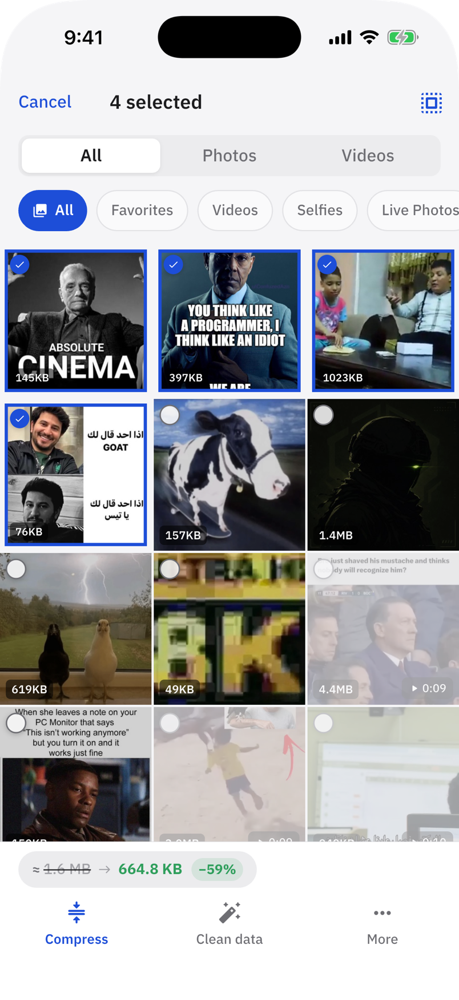
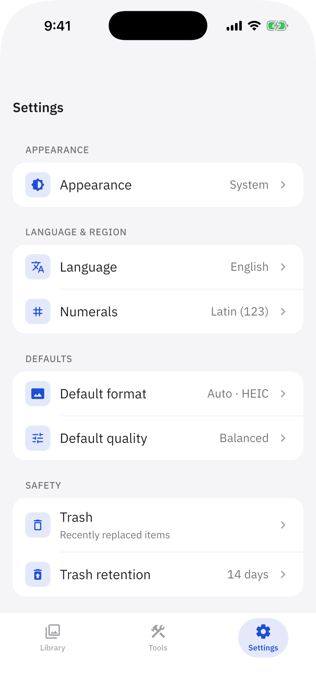

<p align="center">
  
</p>

<h1 align="center">Hayn</h1>

<p align="center">Compress, convert and clean the photos and videos on your phone. Everything runs on the device.</p>

<p align="center">
  
  
  
  
  
  
</p>

## What it is

Hayn is a free app for iOS and Android that works on the
photos and videos already in the phone's library. It changes their format and
size, crops them, removes their metadata, and handles a few jobs on video.

Every result is saved as a new item in the library; the original is not
touched. There is no network code, account, advertising or analytics, and the
release Android build does not request the internet permission.

## Status

Pre-release, version 0.1.0.

| Area | State |
|---|---|
| Library, image conversion, crop, metadata removal | Working. Known defects in HDR, transparency, colour profiles and orientation are listed in [docs/14-ISSUES.md](docs/14-ISSUES.md). |
| Remove audio, extract frames, video to GIF | Working, on FFmpeg. |
| Trim, video crop, photos to animation, voice and music separation | Screens only; no engine yet. |

## Features

### Library

The device's photos and videos in one grid, filtered by album, type or sort
order. Each item shows its size, and each video its length.

<p align="center">
  <picture>
    <source media="(prefers-color-scheme: dark)" srcset="docs/screenshots/library-dark.png">
    
  </picture>
</p>

### Working on a selection

Select photos or videos and the bar at the bottom offers the tools for them.
A selection holds one media type at a time, and shows the expected saving
before anything runs. A photo or video opened on its own offers the same
tools, plus crop.

- **Convert and compress** — to AVIF, HEIC (HEIF on Android), WebP, JPEG or
  PNG at a chosen quality. **Auto** takes the first format the device can
  encode, in the order AVIF, HEIC, WebP, and falls back to PNG to keep
  transparency.
- **Crop** — free or fixed aspect ratio.
- **Metadata** — remove EXIF, GPS and other metadata.
- **Video** — remove the audio track without re-encoding the picture, extract
  frames, or turn a clip into a GIF.
- **Share or delete** the selection.

<p align="center">
  <picture>
    <source media="(prefers-color-scheme: dark)" srcset="docs/screenshots/selection-dark.png">
    
  </picture>
</p>

Long jobs run in a queue off the UI thread, with progress and cancel.

### Settings

Arabic or English, with the layout direction following the language;
Arabic-Indic or Latin numerals; light, dark or the system appearance; and the
default format and quality for new jobs.

<p align="center">
  <picture>
    <source media="(prefers-color-scheme: dark)" srcset="docs/screenshots/settings-dark.png">
    
  </picture>
</p>

## Built with

| | |
|---|---|
| Image core | DarkLib, Rust (`native/darklib`), bound with `flutter_rust_bridge` 2.12 and built by Cargokit |
| Video | `ffmpeg_kit_flutter_new_min` 3.6.2 — LGPL build, without x264 or x265 |
| Other codecs | `flutter_image_compress`, `flutter_avif`, platform HEIC bridges |
| Library access | `photo_manager` |
| State and routing | Riverpod 2, `go_router` |
| Storage | Drift (media index), `shared_preferences` |
| Localisation | `flutter_localizations`, `intl`, ARB |
| Typeface | IBM Plex Sans Arabic, bundled |

## Layout

```
lib/app/              Bootstrap, theme, localisation, routing, tab shell
lib/core/             Capabilities, isolates, task runner, results
lib/data/             Media index (Drift)
lib/features/         One folder per feature: library, image_ops, video_ops, …
lib/src/rust/         Generated Dart bindings for DarkLib
native/darklib/       DarkLib, the Rust image core
rust_builder/         Cargokit plugin that builds DarkLib for each platform
ios/  android/        Platform projects and native bridges
tool/app_icon/        App icon generator for iOS and Android
tool/screenshots/     README screenshot generator and its photos
docs/                 Product, architecture and status documents
```

## Running

```bash
flutter pub get
flutter analyze
flutter test                          # 205 tests
(cd native/darklib && cargo test)     # 123 tests

flutter run                           # on a connected device or simulator
flutter build apk --release
flutter build ios --release

# After editing the icon geometry in the script
python3 tool/app_icon/generate.py

# After a UI change: rebuilds docs/screenshots/ from a fresh iOS simulator
tool/screenshots/generate.sh
```

Building needs a Rust toolchain; Cargokit adds each platform's target. iOS
builds also need the iOS platform in Xcode (Settings → Components). Local
setup is in [docs/20-LINUX-WORKFLOW.md](docs/20-LINUX-WORKFLOW.md) (Linux, the main
development machine) and [docs/13-DEVELOPMENT.md](docs/13-DEVELOPMENT.md) (the Mac,
used for iOS builds and iPhone testing).

Documentation and project rules are in Arabic; code is in English. Start with
[CLAUDE.md](CLAUDE.md); known defects and their state are in
[docs/14-ISSUES.md](docs/14-ISSUES.md).

## Licence

```
Hayn
Copyright (C) 2026  m7md-d
```

Free software under the **GNU General Public License, version 3**, including
DarkLib (`native/darklib`). Distributed in the hope that it will be useful, but
**with no warranty** — without even the implied warranty of merchantability or
fitness for a particular purpose. Full text in [`LICENSE`](LICENSE).

### Third party

| | Licence |
|---|---|
| **IBM Plex Sans Arabic** — bundled typeface | SIL Open Font License 1.1, text in [`assets/fonts/OFL.txt`](assets/fonts/OFL.txt) |
| **FFmpeg** — through `ffmpeg_kit_flutter_new_min` | LGPL-3.0 |
| Dart and Flutter packages | Listed in the app under Settings → About → Open-source licenses |
