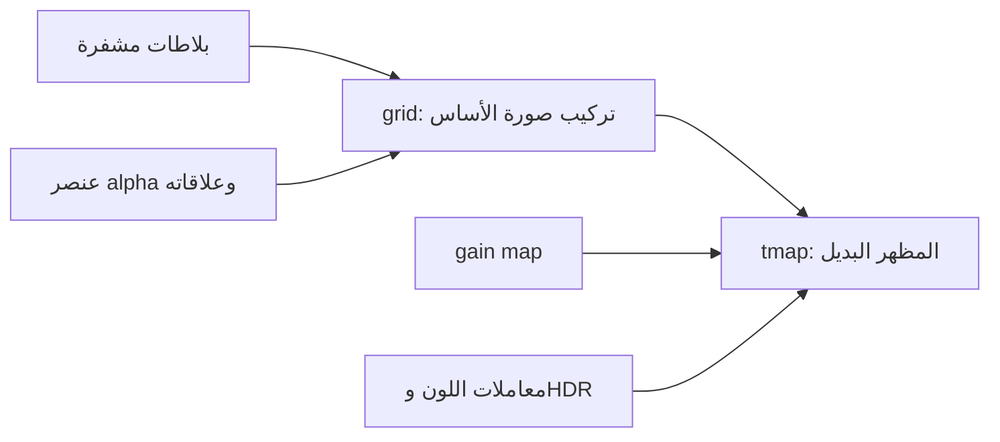

# 11 — HDR وHEIF/AVIF: البحث الذي يحكم التنفيذ

مراجعة 2026-09-26. تميّز هذه الوثيقة بين المواصفات المنشورة، ملاحظة في الكود، واختبار محلي. لم تُفحص مكتبة صور المستخدم أو عينة من كل إصدار iPhone. لا نعمم شكل ملف واحد على جميع أجهزة Apple.

## الشبكة ليست خريطة HDR

HEIF حاوية لعناصر وعلاقات؛ قد تكون الصورة المعروضة مشتقة من عدة صور صغيرة. `grid` يعيد تركيب بلاطات مكانية، و`dimg` يربط العنصر المشتق بمدخلاته. `ispe` يصف الأبعاد و`pixi` دقة القنوات، وتوجد خصائص لون وتحويلات يجب احترام ترتيبها. وجود grid طبيعي ولا يثبت عطلًا أو HDR. [شرح HEIF من Nokia](https://nokiatech.github.io/heif/technical.html).

AVIF يستخدم هذا النموذج مع AV1، ويجيز `grid` و`tmap`. للألفا عنصر مساعد وعلاقات وقيود، وقد تتطلب الصورة تتبع أكثر من عنصر. `tmap` يمثل مظهرًا مشتقًا، ويمكن ربطه بالأساس ضمن مجموعة بدائل `altr`. فحص أول `av01` أو أول auxiliary فقط لا يكفي لتقييم الملف. [مواصفة AVIF 1.2، خصوصًا §4 و§5](https://aomediacodec.github.io/av1-avif/v1.2.0.html).

رسم مفهومي؛ ليس تركيبًا ثابتًا لكل ملف:

لذلك لا نحذف كود grid باعتباره تعقيدًا غير مبرر. نختبر صحة علاقاته وخصائصه، وهل يعالج العناصر المساعدة والتحويلات كما ينبغي.

## ثلاثة تمثيلات يجب فصلها

| التمثيل | ما يحتاجه الحفظ |
|---|---|
| SDR واسع اللون مثل Display P3 | بكسلات وتفسير لون صحيح؛ P3 وحده لا يعني HDR |
| HDR مباشر PQ/HLG | دقة كافية ودالة نقل وفضاء لون ومسار لا يقص الإضاءة |
| Gain-map HDR | صورة أساس وخريطة ومعاملات وإشارة لربطها وإعادة البناء |

توضح Apple أن ISO HDR المباشر له متطلبات دقة ولون، وأن `expandToHDR` يستطيع تكوين HDR من الأساس وخريطة الإضاءة. فك الصورة افتراضيًا إلى SDR ثم حفظها بعمق أعلى لا يستعيد المعلومات المفقودة. كما أن سياسة Photos Picker قد تعيد ترميز الأصل؛ سلسلة الحفظ تبدأ من جلب التمثيل الصحيح، قبل دخول codec. [Apple WWDC23: Support HDR images](https://developer.apple.com/videos/play/wwdc2023/10181/).

تصف Apple تمثيل gain map القديم بنوع auxiliary هو `urn:com:apple:photo:2020:aux:hdrgainmap`، وخريطة إضاءة أحادية القناة بدقة 8-bit. لذلك ربط HDR بعمق الصورة الأساسية فقط خطأ. لا نساوي بين هذا التمثيل وتمثيل ISO الأحدث أو ننقل معاملاتهما عشوائيًا. [توثيق Apple Gain Map](https://developer.apple.com/documentation/appkit/applying-apple-hdr-effect-to-your-photos).

في WWDC24 شرحت Apple انتقال أجهزة وإصدارات محددة إلى Adaptive HDR في iOS 18: خريطة قد تكون متعددة القنوات، وتمثيل أساس قد يكون SDR أو HDR. الملف الذي يُعد صورة واحدة عبر ImageIO يمكن أن يحتوي مظهرًا بديلًا مشتقًا؛ عدد الصور الذي تعيده API ليس جردًا كاملًا لعناصر الحاوية. القص الهندسي يجب أن يظل متسقًا بين الأساس والخريطة، وتعديل السطوع قد يحتاج إعادة حساب الخريطة. [Apple WWDC24: Adaptive HDR](https://developer.apple.com/videos/play/wwdc2024/10177/).

كانت المواصفة مسودة وقت جلسة 2024؛ نُشرت **ISO 21496-1:2025 في يوليو 2025**. نطاقها gain map ومعاملاتها واستخدامها للتحويل بين تمثيلين، وليست اسم codec جديدًا. راجعت وصف ISO العام؛ لم أشترِ النص الكامل، فلا تنسب هذه الدراسة إليه تفاصيل ثنائية لم تُقرأ. [صفحة ISO الرسمية](https://www.iso.org/standard/86775.html).

## JPEG أيضًا قد يحمل HDR

في Ultra HDR توجد صورة JPEG أساسية وصورة إضافية للخريطة، مع معلومات XMP وMPF للعثور عليها وتفسيرها. حذف APP1 مع الإبقاء على APP2 ليس بالضرورة آمنًا: قد تتغير offsets أو تزول إشارات لازمة. العرض الناجح لصورة SDR لا يثبت بقاء HDR؛ قارئ متسامح قد يتجاهل البيانات غير الصالحة. [مواصفة Android Ultra HDR v1.1](https://developer.android.com/media/platform/hdr-image-format).

ملاحظة محلية مؤكدة: عينة `seine_sdr_gainmap_srgb.jpg` من corpus libavif كانت 142972 بايت، وبعد strip صارت 74701. مرجع الصورة الثانية في MPF لم يعد يشير إلى بداية JPEG، وبقي حجم الصورة الأولى القديم. هذا خلل في إعادة كتابة المرجع، لا اعتراض على فكرة الحفاظ على الخريطة. حفظ بايتات الخريطة وحدها لا يكفي.

## ماذا أثبت الفحص في DarkLib؟

| الملاحظة | الاستنتاج المحدود |
|---|---|
| `Decoded` يستخدم `Vec<u8>`، وفك AVIF يخفض العينات إلى 8-bit | هذا المسار لا يثبت حفظ دقة HDR المباشر |
| عينة PQ/Rec.2020 أصبحت sRGB لدى ImageIO بعد التحويل | فقد HDR/دلالة لون مثبت لهذه العينة؛ ليس حكمًا على كل HEIC |
| `pixi` في writer الشبكة يكتب 8 بينما حمولة ravif الافتراضية قد تكون 10 | تعارض خصائص؛ قبول قارئ له لا يجعل الملف متسقًا |
| عينة grid ذات alpha على مستوى البلاطات تفقد alpha في القارئ الحالي | اختبار الشفافية على صورة بسيطة لا يغطي كل graph |
| بعض خطوات `transcode_hdr_avif` تعيد `None` ثم يُسلك مسار SDR | التحذير وشرط الحفظ يجب أن يكونا جزءًا من النتيجة |
| اختبار `hdr_avif_gainmap_survives_convert` يستخدم نصًا اصطناعيًا كمعاملات tmap | يختبر حمل البايتات، ولا يثبت امتثال المعاملات أو صحة الإضاءة |

المراجع المحلية: `native/darklib/src/engine/codec/mod.rs`، `codec/avif_dav1d.rs`، `metadata/isobmff.rs`، `metadata/jpeg.rs`. هذه الأدلة تبرر إصلاحًا واختبارات مستقلة؛ لا تبرر حذف دعم العناصر المساعدة أو استبدال المحرك كله فورًا.

جسر iOS الذي ينقل auxiliary data ويفحص HDR مستقلًا عن bit depth له أساس صحيح. ما يزال يحتاج اختبارًا لكل عملية، خاصة إزالة بيانات الخصوصية مع بقاء معاملات لازمة، أو إعادة ترميز/قص الأساس. نسخ EXIF بالكامل قد يحافظ على معلومات لازمة لكنه ليس سياسة خصوصية انتقائية، ونسخ الخريطة لا يثبت توافقها مع بكسلات تغيرت.

## الاختبارات المطلوبة قبل إعلان الحفظ

1. عينات منفصلة: Apple gain map القديم، ISO gain map، JPEG Ultra HDR، AVIF tmap، PQ، HLG، grids مع alpha، P3 SDR، ودوران/انعكاس/قص. عينات كاميرا مأذون بها لاحقًا مع نزع الخصوصية خارج corpus العام.
2. لكل عينة سجل المصدر والرخصة والـhash، وإصدار النظام/codec، وgraph العناصر، واللون والدقة والأبعاد قبل وبعد.
3. strip بلا re-encode: قارن payloads المحفوظة، ثم تحقق offsets والعلاقات والخصوصية والعرض. لا تكتفِ بمطابقة hashes للحمولة.
4. transcode: افحص SDR وHDR كلًا على حدة؛ قارن إعادة البناء في فضاء خطي مناسب وعند headroom محدد. لا تقارن screenshots متفاوتة السطوع باعتبارها مرجعًا ثابتًا.
5. قارئ مستقل مثل ImageIO أو libavif، واختبار رفض عند تعذر شرط الحفظ. اختبارنا الداخلي قد يكرر افتراض writer نفسه.
6. هاتف iOS وهاتف Android فعليان: صحة العرض وحفظه، الذاكرة، الإلغاء، والفرق بين نسخة الملف الأصلية ونسخة التصدير من المعرض.

يحتوي corpus libavif على عينات alpha والتحويلات والشبكات وgain maps مفيدة لهذا الغرض، مع وصف ورخص لكل عينة. لا ننسخ المستودع كله داخل التطبيق. [Corpus الرسمي](https://github.com/AOMediaCodec/libavif/blob/main/tests/data/README.md).

## القرار المعماري الناتج

نحتفظ بالتجريد الموحد، ونوقف توسيع الكاتب اليدوي حتى تثبت الحالات الحالية. libavif مرشح لتقليل مسؤولية الحاوية؛ API الخاصة به تفصل planes واللون والتحويلات وgain map، لكن التحويلات لا تُطبَّق على البكسلات تلقائيًا في كل API. إذًا استخدامه لا يعفينا من سياسة تحويل واختبارات. [واجهة libavif الرسمية](https://github.com/AOMediaCodec/libavif/blob/main/include/avif/avif.h).

تفاوت الحجم بين جهازين لا يثبت خلل الصيغة. نقيس المصدر نفسه، المحرك وإصداره، وضع rate control، الجودة، subsampling، الدقة، الأبعاد، والبيانات المساعدة. Android يعرّف نطاق جودة خاصًا بكل encoder، وعادة تدل القيمة الأعلى على جودة أعلى؛ لا يصح تمرير quantizer معكوس إلى `KEY_QUALITY` على افتراض أنه المعنى نفسه. [Android EncoderCapabilities](https://developer.android.com/reference/android/media/MediaCodecInfo.EncoderCapabilities#getQualityRange()). هذه النقطة تحتاج قياسًا على الجهاز، وليس حكمًا رقميًا نهائيًا من مراجعة الكود فقط.
